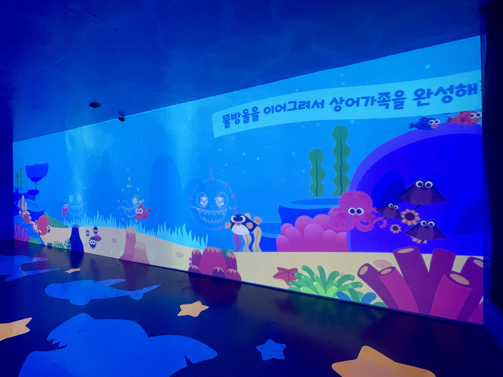
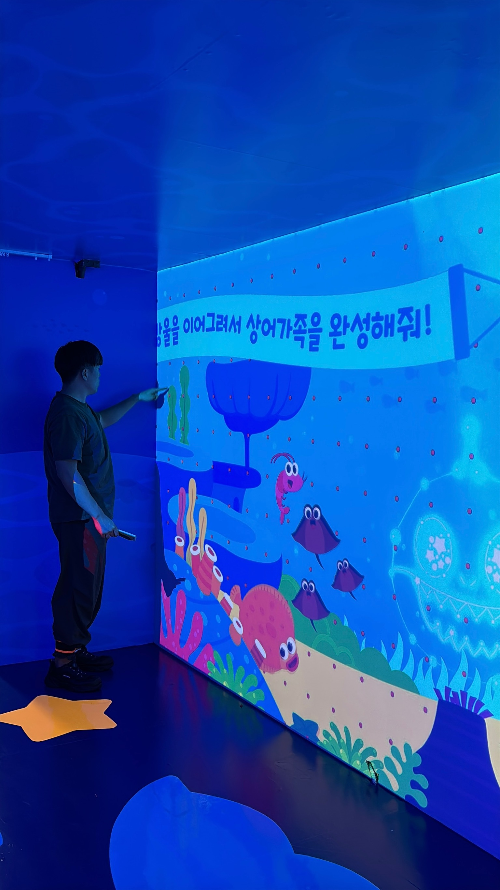
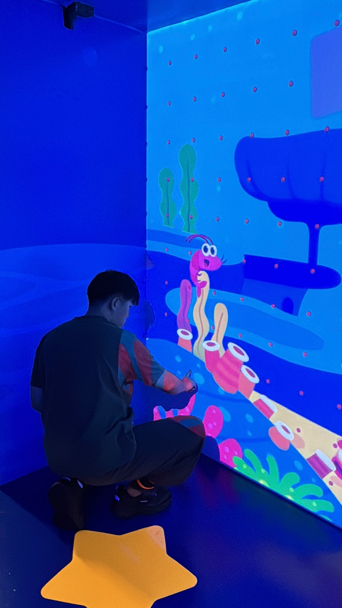
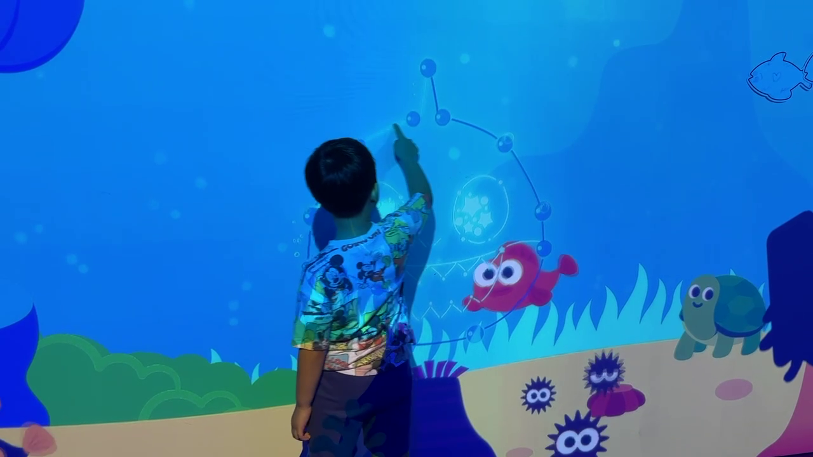

# 8m 벽면에 LiDAR를 붙이고 배운 것 — 정밀함보다 중요한 것

> 호쿠요 LiDAR, 5cm 오차, 아이들의 손가락. 에버랜드 현장에서 인터랙션 규칙을 다시 설계한 이야기.

*2026-03-14 · 현장 노트*

## 8미터 벽면, 라이다 하나

에버랜드 콩콩팡팡 전시. 높이 2.5m, 너비 8m짜리 벽면에 바다 생물들이 헤엄칩니다. 아이가 벽을 만지면 캐릭터가 반응하고, 말미잘에서 뿜어져 나오는 거품을 손가락으로 이어 그리면 아기상어가 나타나 인사를 하고 헤엄쳐 갑니다.

이 벽면 전체를 호쿠요 LiDAR 한 대가 감지합니다. 터치와 드래그, 두 가지 인터랙션을 지원합니다.

## 정밀한 터치를 기대했다

작업 전에는 LiDAR로 터치스크린에 준하는 정밀한 인터랙션이 가능하다고 생각했습니다. 스펙상으로는 그럴 수 있었습니다.

현장에서 좌절했습니다.

문제는 LiDAR 하드웨어의 한계가 아니었습니다. **보정**이었습니다. 센서가 읽어낸 좌표를 실제 벽면 위치에 정확히 매핑하는 일이 약 5cm의 오차를 만들었습니다. 오픈소스 보정 도구([HokuyoUtil](https://github.com/STARRYWORKS-inc/HokuyoUtil)) 위에 자체 보정 로직을 얹었지만, 8m 벽면 전체에서 일관된 정밀도를 뽑아내기는 어려웠습니다.

## 두 가지 영역

벽 위의 인터랙션은 성격이 달랐습니다.

**큼직한 영역** — 헤엄치는 캐릭터들. 몸통 자체가 크기 때문에 어디를 만져도 잘 만져졌습니다. 5cm 오차가 문제되지 않았습니다.

**정밀한 영역** — 말미잘의 거품. 넓은 화면 세 군데에 배치된 말미잘에서 거품이 나오고, 이 거품들을 정확하게 이어야 아기상어가 완성됩니다. 여기서 고생을 많이 했습니다.

## 보정은 노가다였다

정밀한 영역의 보정은 결국 동료와 함께 벽 앞에 서서, 좌표마다 위치와 오프셋을 추가하고 빼고 추가하고 빼는 단순 반복이었습니다. 될 때까지.

시스템에는 이 과정을 지원하는 구조를 만들어 뒀습니다. 벽면의 특정 위치에 보정 포인트를 찍고, 각 포인트에 오프셋을 부여하면 주변 영역은 역거리 가중 보간(IDW)으로 자동 보정됩니다. 하지만 포인트 하나하나를 잡는 건 사람의 손이었습니다.

## 꼼수 — 너그러운 판정

보정만으로는 부족했습니다. 그래서 꼼수를 썼습니다.

터치 좌표를 기점으로 "터치"로 판정되는 반경을 꽤 크게 키웠습니다. 사용자는 대부분 아이들이었습니다. 엄격한 판정보다 **아이들이 만족스러운 경험을 하기 위한 너그러운 판정**이 중요했습니다.

이게 이 프로젝트에서 가장 중요한 설계 판단이었습니다. 센서의 정밀도를 높이는 데 시간을 쓰는 대신, 인터랙션 규칙 자체를 현장에 맞게 다시 설계한 것입니다.

## 코드는 하루 만에 바뀌었다

이 터치 시스템의 코드에는 뒷이야기가 있습니다.

1년 전에 만든 LiDAR-Unity 연동 코드가 있었지만, 새 프로젝트에 쓰려면 대대적인 개편이 필요했습니다. 모든 기능이 하나의 파일에 몰려 있고, 드래그를 지원하지 않고, 설정은 하드코딩되어 있었습니다.

Claude Code에게 큰 틀만 지시했습니다. "과연 이 정도까지 스스로 해낼까?" 의문을 가지면서. 결과는 하루, 한두 개 세션에서 컴파일 에러 하나 없이 끝났습니다. OSC 수신, 좌표 보정, 드래그 추적, 게임플레이 연결까지 깔끔하게 분리된 파이프라인이 만들어졌습니다.

덕분에 현장에서는 코드가 아니라 보정에만 집중할 수 있었습니다. 기술적으로 가장 중요한 전환이었습니다.

## 현장에서 배운 규칙

이 프로젝트에서 얻은 규칙을 정리하면 이렇습니다.

- **LiDAR의 한계는 하드웨어가 아니라 보정이다.** 센서 스펙보다 캘리브레이션 노하우가 결과를 결정합니다.
- **cm 단위 정밀 터치를 약속하지 마라.** 약 5cm 오차를 흡수할 수 있는 큼직한 인터랙션을 설계하는 편이 현실적입니다.
- **너그러운 판정이 좋은 경험이다.** 특히 아이들이 주 사용자라면, 정밀함보다 관대함이 만족도를 만듭니다.
- **코드 구조가 현장 대응력을 결정한다.** 잘 분리된 파이프라인 덕분에 보정 로직만 독립적으로 손볼 수 있었습니다.

이 경험은 2026년에 예정된 새 핑크퐁 IP 전시에서 다른 형식으로 이어질 예정입니다. 보정 로직은 더 나아져야 합니다. 하지만 "너그러운 판정"이라는 원칙은 바뀌지 않을 것입니다.
